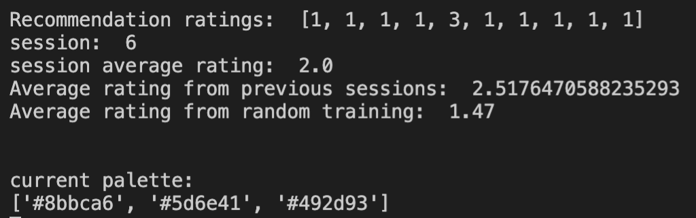

# AI-driven Palette Recommendation
Recommendation system for 3 color palettes written in python. It uses supervised learning in order to predict user rating of palettes, classifying palettes into 3 score classes: 1 2 3 where 1=dislike, 2=neither dislike nor like, 3=like. This classification model is utilized in a recommendation engine that gives palette recommendations based of the learned user preferences.

# Problem Description
The hexadecimal 3 byte web color encoding can represent 16<sup>6</sup> ≈ 16.8 million different colors. With a combination of 3 colors there are (16.8x10<sup>6</sup>)<sup>3</sup> ≈ 4.7 billion possible palettes to choose from. This is definitely too much for a person to go through. One possible solution of the problem of finding good matches for a persons preferences of color combination is to let a recommendation system do the bidding.

## Classification Problem
Recommender systems are one machine learning technique that make prediction based on user’s historical behaviors. The most popular approaches to build such system are Content-based and Collaborative Filtering. Content-Based Filtering requires that there is a good amount of information of item’s own features which is based on the user’s previous ratings on data.  Collaborative filtering on the other hand uses techniques that can filter out items that a user might like based on the user reaction by similar users [1].

### Content-based filtering 
This type of filtering does not involve other users and is based only on one user interaction with the system, the algorithm will simply pick items with similar content to recommend to the user [2]. It turned out that content-based filtering is most applicable to our AI palette recommendation engine.

### Multi-class classification
In machine learning classifying samples into one of three or more classes is called Multi-class classification. This classification method uses predictive modeling and assign each sample with one of more than two classes, which is implemented by predicting the probability of the example belonging to each known class [3].

# Work process

## Data Collection
Since the recommendation engine is supposed to personalize palette recommendations for specific users, data has to be collected and stored for better predictions. We came up with a system that shows the user a randomly generated 3 color palette and asks the user to rate it from 1 to 3 in order to collect preferens data. The 3 byte hexadecimal color codes and the rating number are then written to a csv-file for the later training of the neural network. 


<sub>User interface showing a palette. Input bar for rating at the bottom of the window.<sub>

## Data Preprocessing

### Try #1 - 3 dim palette space
We first tested setting up a model for a 3 dimentional palette space where the axis were each one integer color of the palette. The model learned poorly since the data became to separate which made it hard to measure distance between datapoints and made the classification impossible on a small data set. This could be due to the colors being a mix of the color channels red/green/blue and representing them as decimal integers would for example make two blueish colors with a bit separate red values very distant on a color axis since the most sigificant byte is the red byte of the 3 byte hex colors. This systematic separation could be learned by a network but would proboably require more data than we had access to, therefore we decided to try modelling our sample data in a different way.

### Try #2 - 9 dim palette space
A better way to model the sampla data was to provide additional information about the colors by giving the network the 3 separate color channel values red/green/blue. Instead of keeping them in the 0 to 255 range we normalized them to values between 0 and 1. This lead to a network model with a 9 dimensional palette space, one axis per color channel value in the palette. Additionally we formatted the label data from the 1 to 3 palette rating into a hot one encoding of a 0 to 2 rating. 

The data from the csv file was vectorized as a 2d tensor consisting of 10 dimensional vectors containg the rgb color palette and their respective rating. 

## Modelling and Training the Network

For the intelligence core in our system we decided to use Keras with a tensorflow backend. Keras is one of the most popular python packages for deeplearning as it is simple to learn and can be addapted to many types of machine leraning problems.

In this phase we worked separetly, trying to model, fit and optimize a network to our own data. This was intentionally done in order to explore options and find independently good solutions. Here follows a description of how we designed and trained our networks. 

### Lovisa_NN
This network started out as a keras sequential model where each layer of the network is defined sequentially one after another. Since the sample data had the form of a 9 dimensional vector representing the rgb values of the palette, naturally the first layer should have 9 neurons for each of the color channel inputs. I decided to try at least 2 hidden layers using a deeplearning model on the assumption of that the psychological preferens data containg both concious and non-obvious relasionships could be complex in nature. I also used a multiple of 9 neurons in both of the hidden layers as a mean to balence out the network structure. 

For the activation function of the three first layers I used a linear rectifier function which is commonly used in deep networks as it performs better when training networks for classification problems [4]. The output layer consists of 3 neurons, one for each rating class as we are trying to predict the probability of the input being either a 1, 2 or a 3 on the grading scale according to the networks knowledge of the user palette preferneces. For this layer the softmax activation function was used as it does calculate the probability distiburion of the output classes [5].

For the training of the network the loss function categorical cross entropy was used as it is commonly used for multi-class classification [6]. As the optimizer function of the network training I used Adam which is a first-order gradient-based optimization of stochatic objective functions [7].  

### maryam_ANN
In this network the input data is split to train and test set using train_test_split function from scikit-learn [8], test size is then set up to 0.2 which is 20% of the whole input sample. one hot encoding is used on the label data to convert the labels which are integers 1,2,3 to binary classes to help the model algorithm do a better prediction. Because of the non-linear feature of the data classification there should at least be one hidden layer I decided to have 3 hidden layers with 54 nodes in each layers with rectified linear activation function [9] and because of the nature of the color channel input the first layer should have 9 nodes. Output layer consists of 3 nodes one for each rating class and in this layer softmax activitaion function is used [9].

Categorical cross-entropy is used as loss function for the model as cross-entropy function calculate a score which is the difference between the actucal and predicted probability distributions for all classes and tries to minimize this score to zero as close as possible [3]. I decided to use stochastic gradient descent with a learning rate of 0.01 as the optimizer function [3].

## Validation and Testing

The goal at this stage was to get the prediction accuracy of our network models above the random baseline of simply guessing the class of a sample correctly which in our case is 33 percent. 

### Lovisa_NN
To properly optimize the network without introducing to much bias towards the particular data at hand the data were shuffled and dividet into 3 sets, one each for training, test and validation. Around 80 percent for training and 10 percent each for testing and validation. With this done network parameters such as training batch-size, epochs were altered to see how this affected the accuracy. The network performed generally well with the initial settings with an accuracy of about 50 percent.

The batch size did not notably affect the performance since this network is rather small in size. But what could be seen in the initial training was that the network overfitted rather quickly, that means that the model learned the distinct relations in the data too fast to learn the more subtle relations that would help it to generalize better. To avoid this I introduced dropout between the hidden layers in the model. This means that some percentage of the connection between of these layers are randomly reseted, introducing some random noise into the learning process. This regularization technique reduces the overfitting potential of the network [9]. After some testing the dropout were set to 50 percent. Down below are the graphs of two generated networks with the lovisa.csv data. From the loss graphs we can se that the first achieves a better training loss than test, this is expected since test is new unseen data for the model. But sometimes some networks such as the other below achieves a better loss for the test data than the training just by chance and this does not necessarily mean that they are better at generalizing without further testing.


<sub>Statistics of a network with 72% validation accuracy. Comparing training and test loss and accuracy over the number of epochs. <sub>

 
<sub>Statistics of a network with 76% validation accuracy. Comparing training and test loss and accuracy over the number of epochs.<sub>

### maryam_ANN
After training the network based on statistics from validation data, tried some different technique to find a satisfying balance optimizing the model without overfitting. I added an extra hidden layer and set number of nodes to 54 with a drop-out layer after the second hidden layer, decided to have only one drop-out layer as the model achieved higher accuracy with one drop-out layer.

To calculate the error the model uses a combination of Stochastic gradient descent optimizer algorithm and Mini-batch gradient descent. The model has a learning rate of 0.01 which controls how quickly the model is adapted to the problem. I chose training epoch 200 as smaller learning rates require more epoch because the changes made to the weights are smaller at each update. 

Below are two graphs of two generated networks with maryam.csv. The mmodel68acc_training_plot graph on loss and accuracy shows the network with two hidden layer and 45 in number of nodes and 150 for epochs. The other graph mmodel76acc_validation_plot is set with 3 hidden layer, 54 in number of nodes and 200 epochs.

The models show two line plots, the top one squared hinge loss over epochs for the train (blue) and test (orange) dataset, and the bottom plot showing classification accuracy over epochs. After adding additional layers and nodes to the network we can see from mmodel76acc_validation_plot that in both train and test the number of loss is minimized and hence the accuracy is also improved when the loss is decreased.


<sub>Line plots of squared hinge loss and classification accuracy of the network with 68% i accuracy</sub> 


<sub>Line plots of squared hinge loss and classification accuracy of the network with 76% i accuracy</sub> 

# Palette Recommendation Engine

With a working palette rating predicting network we built a recommendation engine that could generate new palettes with high ratings. To generate recommendations you need to explore the palette space in some way. It is also good if this exploration does not get stuck on repeat in a select space of for example just one user color preferens. Preferably a random element should be included in the exploration to keep finding new interesting palettes. Therefore we used the network as just a filter on a set of 10 randomly generated palettes. This filter works by just selecting palettes predicted to be rated 3 by the user as recommendations. The recommendation generator first tries with 10 sets of 10 random palettes to find a 3, if that is not possible it chooses a palette with a predicted rating of 2 in the last set. The generated recommendation is then showed to the user that can rate it. 

A good way to measure the performance of the recommendation engine is to see if the average rating of the user is better compared to the average rating on randomly generated palettes. The figure below shows the results from a session run of palette_recommender.py. Here we can see that the average from previous sessions with the recommendation engine (data set of 90 palettes) are higher than the average rating of randomly generated palettes from palette_gen.py (data set of 900 palettes).


<sub>Printout from palette_recommender.py running user lovisa and model net72acc.h5. First row shows the predicted rating of the first 10 randomly generated palettes. Session average is the average from the current active run of the program. Previous session average is calculated from the previous runs. Average random training rating is calculated from runs with the random palette generator program palette_gen.py.<sub>

# Recommender Engine with Reinforcement Learning

The models can also be used in a feedback loop that uses multiple predictions to explore the palette space. The exploration is done by uniformly generate randomized palettes and then filtering out the best prediction among them and present that palette to the user. That way there is a stream of new palettes generated and the best, according to the model, is presented to the user. The network is trained every 10th rated palette. The users answers are saved and can be used for further training of the network.

Below is an image of a graph visualizing the reinforced training process of an untrained model. The red line represents the expected value of a uniform distribution of the values 1, 2 and 3. Anything above this line indicates that the recommendations are better than the statistical average and vice versa if below. 

In the first plot a positive trend can be seen at the peeks of the graph while the valleys does not have any clear trend. This is due to the biased training of the network where a increased performance means that it will only learn higher and higher rated palettes only occasionally does some low rated palettes appear. This indicates that the model will learn high rated palettes quicker than the palettes with low ratings. 


<sub>Test of reinforced_palette_recommender.py performed on user bm, training model L_zero.h5. Here the average of every 10 palette ratings are plotted to see if the average increases with the training of the network that happens every 10 rated palette. The red line indicates the expected value of the rating system.<sub>


<sub>Test of reinforced_palette_recommender.py performed on m_zero.h5 model, the average of 10 palette rating is plotted to see if the average is increasing and it shows that the recommendation are better than the statistical average.</sub>

# Building
The dependencies are pretty standard as far as machine learning goes and should not be any problems to setup. The recommended way is to install everything via pip as far as possible. 

## Dependencies
- python3 (assumed to be installed)
- matplotlib
- keras
- tensorflow (CPU backend only)
- numpy

### Linux (Ubuntu-based, 18.10+)
Open up a terminal using bash and enter the following commands.
```bash
# update pip just in case
pip install --upgrade pip

# matplotlib
python -m pip install -U pip
python -m pip install -U matplotlib

# keras + tensorflow
pip install keras
pip install tensorflow

# numpy (recommended installation via pip)
python -m pip install --user numpy scipy matplotlib ipython jupyter pandas sympy nose
```

### macOS (Catalina)
Same as under Linux.

### Windows 10 
Same as under Linux.

# Running 
The training of the neural network is performed on the CPU and not the GPU due to the small size of the network this is not an issue.

## palette_gen.py
User rates randomly generated palettes in order to collect data to train network models. No palette recommendations are used here.

Example of a test run:
```bash
> python3 palette_gen.py 
Current user profiles: ['lovisa', 'maryam', 'test']
Please enter user_id: test
current palette:
['#32dc99', '#342b8f', '#b0ca0f']
input: 2
Written 

session:  1
current palette:
['#6bb789', '#ca535d', '#3ff9f1']
input: 3
Written 

session:  2
current palette:
['#a5124c', '#0f44b8', '#ff770f']
```

## Models/
Description of saved models that can be ustilized in palette_recommender.py or reinforcement_palette_recommender.py.
- L_zero.h5
    - Untrained network generated from Lovisa_NN.py
- net72acc.h5
    - Network generated from Lovisa_NN.py, trained, tested and validated with Data_mining/lovisa.csv. Validation accuracy of 72%.
- net76acc.h5
    - Network generated from Lovisa_NN.py, trained, tested and validated with Data_mining/lovisa.csv. Validation accuracy of 76%.
- m_zero.h5
    - Untrained network generated from maryam_ANN.py
- mmodel76acc.h5
    - Network generated from maryam_ANN.py, trained, tested and validated with Data_mining/maryam.csv. Validation accuracy of 76%.


## palette_recommender.py
Lets user choose a network and rate recommendations given by the network. Avrages of current user session rating as well as previous session ratings of the same user are given to compare them to the avrage rating on random training data (if it exsists for the specific user). No reinforcement with the user feedback is used in this version to further train the network.

Example of a test run:
```bash
> python3 palette_recommender.py
Using TensorFlow backend.
Current user profiles: ['lovisa', 'maryam', 'alex', 'bm', 'test_user']
Please enter user_id: test_user
no previous sessions found
Training data not found
Current models:  ['mmodel76acc.h5', 'L_zero.h5', 'm_zero.h5', 'net76acc.h5', 'net72acc.h5']
Please enter model name: L_zero.h5
2020-01-06 15:29:17.733706: I tensorflow/core/platform/cpu_feature_guard.cc:142] Your CPU supports instructions that this TensorFlow binary was not compiled to use: AVX2 FMA
2020-01-06 15:29:17.761470: I tensorflow/compiler/xla/service/service.cc:168] XLA service 0x7fc574f6db80 executing computations on platform Host. Devices:
2020-01-06 15:29:17.761494: I tensorflow/compiler/xla/service/service.cc:175]   StreamExecutor device (0): Host, Default Version
Recommendation ratings:  [2, 2, 2, 2, 2, 2, 2, 2, 2, 2]
Recommendation ratings:  [2, 2, 2, 2, 2, 2, 2, 2, 2, 2]
Recommendation ratings:  [2, 2, 2, 2, 2, 2, 2, 2, 2, 2]
Recommendation ratings:  [2, 2, 2, 2, 2, 2, 2, 2, 2, 2]
Recommendation ratings:  [2, 2, 2, 2, 2, 2, 2, 2, 2, 2]
Recommendation ratings:  [2, 2, 2, 2, 2, 2, 2, 2, 2, 2]
Recommendation ratings:  [2, 2, 2, 2, 2, 2, 2, 2, 2, 2]
Recommendation ratings:  [2, 2, 2, 2, 2, 2, 2, 2, 2, 2]
Recommendation ratings:  [2, 2, 2, 2, 2, 2, 2, 2, 2, 2]
Recommendation ratings:  [2, 2, 2, 2, 2, 2, 2, 2, 2, 2]
No 3 rated palette found
current palette:
['#5aaf51', '#f938f2', '#71c68a']
```

## reinforcement_palette_recommender.py
Start with a untrained network or a model of choice and iteratively train model by giving it feedback on presented recommendations.

Example of a test run:
```bash
> python3 reinforcement_palette_recommender.py
Using TensorFlow backend.
Current user profiles: ['lovisa', 'maryam', 'alex', 'bm', 'test_user']
Please enter user_id: test_user
no previous sessions found
Training data not found
Current models:  ['mmodel76acc.h5', 'L_zero.h5', 'm_zero.h5', 'net76acc.h5', 'net72acc.h5']
Please enter model name: L_zero.h5
2020-01-06 15:33:04.502777: I tensorflow/core/platform/cpu_feature_guard.cc:142] Your CPU supports instructions that this TensorFlow binary was not compiled to use: AVX2 FMA
2020-01-06 15:33:04.518002: I tensorflow/compiler/xla/service/service.cc:168] XLA service 0x7fb223f23910 executing computations on platform Host. Devices:
2020-01-06 15:33:04.518028: I tensorflow/compiler/xla/service/service.cc:175]   StreamExecutor device (0): Host, Default Version
Recommendation ratings:  [2, 2, 2, 2, 2, 2, 2, 2, 2, 2]
Recommendation ratings:  [2, 2, 2, 2, 2, 2, 2, 2, 2, 2]
Recommendation ratings:  [2, 2, 2, 2, 2, 2, 2, 2, 2, 2]
Recommendation ratings:  [2, 2, 2, 2, 2, 2, 2, 2, 2, 2]
Recommendation ratings:  [2, 2, 2, 2, 2, 2, 2, 2, 2, 2]
Recommendation ratings:  [2, 2, 2, 2, 2, 2, 2, 2, 2, 2]
Recommendation ratings:  [2, 2, 2, 2, 2, 2, 2, 2, 2, 2]
Recommendation ratings:  [2, 2, 2, 2, 2, 2, 2, 2, 2, 2]
Recommendation ratings:  [2, 2, 2, 2, 2, 2, 2, 2, 2, 2]
Recommendation ratings:  [2, 2, 2, 2, 2, 2, 2, 2, 2, 2]
No 3 rated palette found
current palette:
['#edceb1', '#ac8c58', '#fc6bd9']
```

# References

[1] Shuyu Luo. "Introduction to Recommender System". 2018. url: https://towardsdatascience.com/intro-to-recommender-system-collaborative-filtering-64a238194a26. (visited on 01/03/2020).

[2] Emma Grimaldi. "How to build a content-based movie recommender system with Natural Language Processing". 2018. url: https://towardsdatascience.com/how-to-build-from-scratch-a-content-based-movie-recommender-with-natural-language-processing-25ad400eb243. (visited on 01/03/2020).

[3] Jason Brownlee. "How to Choose Loss Functions When Training Deep Learning Neural Networks". 2019. url: https://machinelearningmastery.com/how-to-choose-loss-functions-when-training-deep-learning-neural-networks/. (visited on 01/03/2020).

[4] X. Glorot, A. Bordes, and Y. Bengio. “Deep sparse rectifier neural net-works”. In: vol. 15. 2011, pp. 315–323.

[5] Uniqtech, Data Science Bootcamp. "Understand the Softmax Function in Minutes". 2018. url: https://medium.com/data-science-bootcamp/understand-the-softmax-function-in-minutes-f3a59641e86d. (visited on 01/05/2020).

[6] Raúl Gómez. "Understanding Categorical Cross-Entropy Loss, Binary Cross-Entropy Loss, Softmax Loss, Logistic Loss, Focal Loss and all those confusing names". 2018. url: https://gombru.github.io/2018/05/23/cross_entropy_loss/. (visited on 01/05/2020).

[7] Diederik Kingma, Jimmy Ba. Adam: "A Method for Stochastic Optimization". 2014. url: https://arxiv.org/abs/1412.6980v8. (visited on 01/05/2020).

[8] Sunny Srinidhi. "How to split your dataset to train and test datasets using SciKit Learn". 2018. url: https://medium.com/@contactsunny/how-to-split-your-dataset-to-train-and-test-datasets-using-scikit-learn-e7cf6eb5e0d. (visited on 01/03/2020).

[9] Chollet Francois. Deep Learning with Python. Manning Publications, 2017. url: https://learning.oreilly.com/library/view/deep-learning-with/9781617294433/OEBPS/Text/title.xhtml. ISBN: 9781617294433  

[10] Jason Brownlee. "How to Choose Loss Functions When Training Deep Learning Neural Networks". 2019. url: https://machinelearningmastery.com/how-to-choose-loss-functions-when-training-deep-learning-neural-networks/. (visited on 01/03/2020).