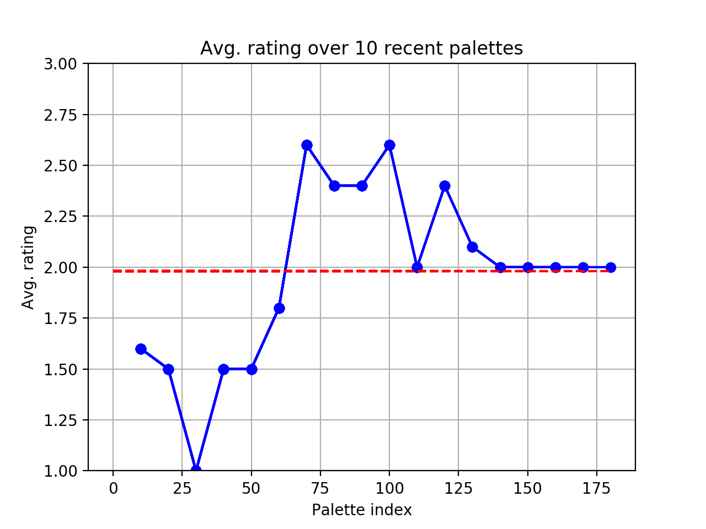

# AI-driven Palette Recommendation
Recommendation system for 3 color palettes

Uses supervised learning in order to predict user rating of palettes, classifying palettes into 3 score classes: 1 2 3 where 1=dislike, 2=neither dislike nor like, 3=like.

# Work process


## Data collection
Since the recommendation engine is supposed to personalize palette recommendations for specific users, data has to be collected and stored for better predictions. We came up with a system that shows the user a randomly generated 3 color palette and asks the user to rate it from 1 to 3 in order to collect preferens data. The 3 byte hexadecimal color codes and the rating number are then written to a csv-file for the later training of the neural network. 

## Data preprocessing

### Try #1 - 3 dim palette space
We first tested setting up a model for a 3 dimentional palette space where the axis were each one integer color of the palette. The model learned poorly since the data became to separate which made it hard to measure distance between datapoints and made the classification impossible on a small data set. This could be due to the colors being a mix of the color channels red/green/blue and representing them as decimal integers would for example make two blueish colors with a bit separate red values very distant on a color axis since the most sigificant byte is the red byte of the 3 byte hex colors. This systematic separation could be learned by a network but would proboably require more data than we had access to, therefore we decided to try modelling our sample data in a different way.

### Try #2 - 9 dim palette space
A better way to model the sampla data was to provide additional information about the colors by giving the network the 3 separate color channel values red/green/blue. Instead of keeping them in the 0 to 255 range we normalized them to values between 0 and 1. This lead to a network model with a 9 dimensional palette space, one axis per color channel value in the palette. Additionally we formatted the label data from the 1 to 3 palette rating into a hot one encoding of a 0 to 2 rating. 

The data from the csv file was vectorized as a 2d tensor consisting of 10 dimensional vectors containg the rgb color palette and their respective rating. 

## Modelling and training the network

## Validation and testing

Goal - achieve high accuracy of prediction ratings of a palette, at least higher than the random basline of 0.33

try some optimizations of the network using the statistics from the validation data 

find a good balance with optimizing the model to the training data with a good ability to generalize, avoid overfitting with regularization techniques such as adding drop-out to layers, 50% dropout was used in two layers

decide good values for number of layers and their size 

Goal for the recommenation engine - achieve a higher avarage of rating with recommended palettes than randomly generated palettes


Statistics from training and testing 

 

# Reinforcement learning model
The NN is used in a feedback loop that uses multiple predictions to explore the palette space. The exploration is done by uniformly generate randomized palettes and then filtering out the best prediction among them and present that palette to the user. That way there is a stream of new palettes generated and the best, according to the NN, is presented to the user. 

The users answers are saved and used for further training of the network.

Below is an image of a graph visualizing ... 
The red line represents the expected value of a uniform distrubtion of the values 1, 2 and 3. Anything above this line indicates that the recommendations are better than the statistical average and vice versa if below.



# Building
The dependencies are pretty standard as far as machine learning goes and should not be any problems to setup. The recommended way is to install everything via pip as far as possible. 

## Dependencies
- python3 (assumed to be installed)
- matplotlib
- keras
- tensorflow (CPU backend only)
- numpy

### Linux (Ubuntu-based, 18.10+)
Open up a terminal using bash and enter the following commands.
```bash
# update pip just in case
pip install --upgrade pip

# matplotlib
python -m pip install -U pip
python -m pip install -U matplotlib

# keras + tensorflow
pip install keras
pip install tensorflow

# numpy (recommended installation via pip)
python -m pip install --user numpy scipy matplotlib ipython jupyter pandas sympy nose
```

### macOS (Catalina)
Same as under Linux.

### Windows 10 
Same as under Linux.

# Running 
The training of the neural network is performed on the CPU and not the GPU due to the small size of the network this is not an issue.

## palette_gen.py
User rates randomly generated palettes in order to collect data to train network models. No palette recommendations are used here.

## NN_test.py
Generate new network with user data.

## palette_recommender.py
Lets user choose a network and rate recommendations given by the network. Avrages of current user session rating as well as previous session ratings of the same user are given to compare them to the avrage rating on random training data (if it exsists for the specific user). No reinforcement with the user feedback is used in this version to further train the network.

## reinforcement_palette_recommender.py
Start with a blank netwrok or a model of choice and iteratively train model by giving it feedback on presented recommendations.

# Test data structure / training data

# References
1. Chollet Francois. Deep Learning with Python. Manning Publications, 2017. ISBN: 9781617294433  
2. TODO
3. TODO